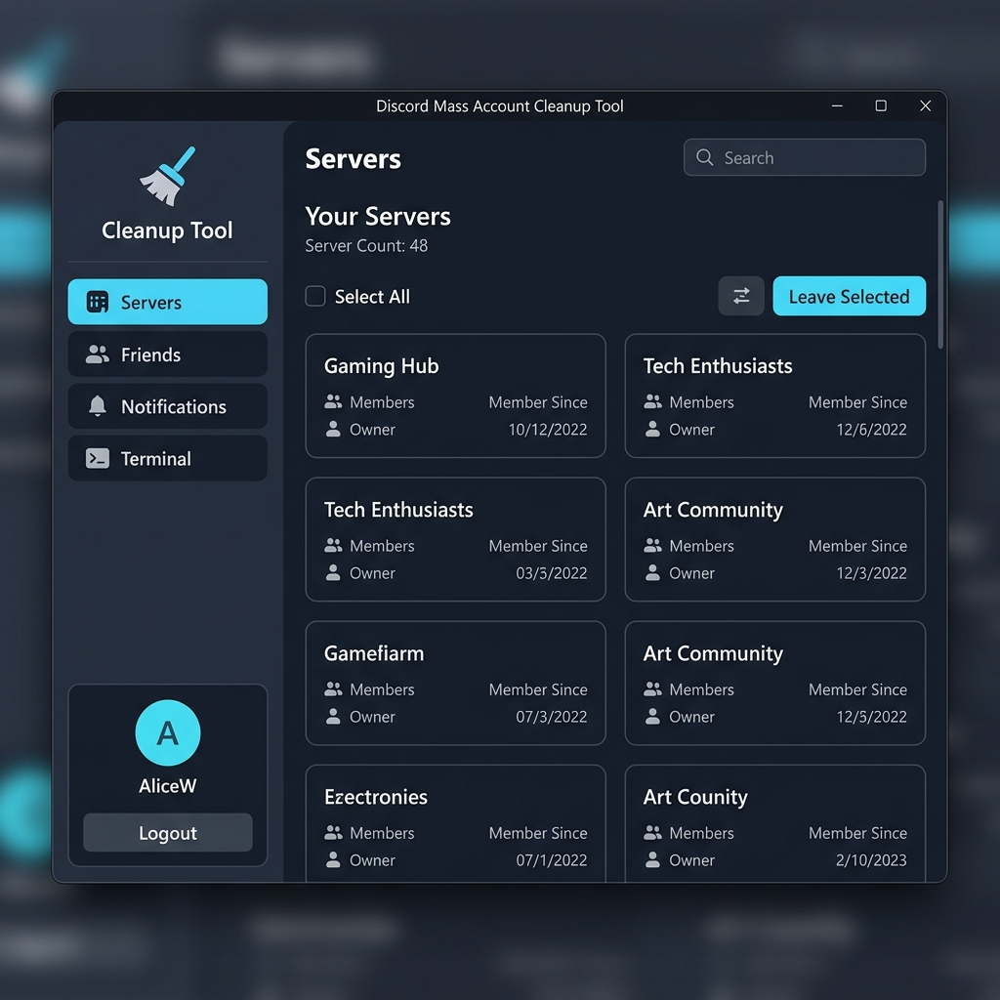

# Discord Mass Account Cleanup Tool

A desktop app and CLI tool for quickly cleaning up your Discord account. Mass leave servers, remove friends, block users, and clear notifications — all in one place.



## Download

> **No Python required** — grab the latest pre-built Windows executable from the [**Releases page**](https://github.com/AnasBabari/Discord-Mass-Account-Cleanup-Tool/releases/latest).

Just download `Discord-Mass-Cleanup-Tool.exe`, double-click, and go.

## Features

- **Mass Leave Servers** — select individually, by range, or all at once with server details and member-since dates
- **Mass Remove Friends** — same flexible selection with search filtering
- **Mass Block Users** — bulk-block selected friends
- **Mass Read Notifications** — instantly mark all DMs, group chats, and server channels as read via WebSocket
- **Desktop GUI** — polished PyQt5 interface with dark theme, animated splash screen, real-time progress, and toast notifications
- **CLI Mode** — fully interactive terminal interface, no GUI required
- **Secure Token Storage** — token saved to your OS credential manager via `keyring`
- **Rate-Limit Handling** — automatic retry with backoff on Discord 429s and Cloudflare blocks
- **Anti-Detection** — uses `curl_cffi` with browser impersonation to bypass Cloudflare fingerprinting

## For Developers

All source code lives in the [`source/`](source/) directory.

### Requirements

- Python 3.10+

```bash
cd source
pip install -r requirements.txt
```

Key dependencies: `curl_cffi` (Cloudflare bypass via browser impersonation), `websocket-client` (Discord Gateway for notification read-states), `PyQt5` + `qtawesome` (GUI), `keyring` (secure token storage).

### Run from source

**GUI (recommended):**
```bash
cd source
python gui_app.py
```

**CLI:**
```bash
cd source
python discord_mass_cleanup.py
```

### Build the exe yourself

```bash
cd source
pip install pyinstaller
pyinstaller gui_app.spec
```

The built exe will be at `source/dist/gui_app.exe`.

## How to Get Your Discord User Token

1. Open [Discord Web App](https://discord.com/app) and log in.
2. Press `F12` → go to the **Application** tab → **Local Storage** → `https://discord.com`.
3. Press `Ctrl+Shift+M` (`Cmd+Shift+M` on Mac) to enable mobile view (Discord hides the token on desktop).
4. Type `token` in the filter bar and copy the value (without quotes).

## Testing

```bash
cd source
pytest test_discord_mass_cleanup.py -v   # Core API tests (58 tests)
pytest test_gui.py -v                     # GUI component tests (4 tests)
```

## Project Structure

```
├── README.md
├── LICENSE
├── .gitignore
├── .github/workflows/release.yml   # CI: auto-build exe on tag push
└── source/
    ├── gui_app.py                   # PyQt5 desktop GUI entry point
    ├── discord_mass_cleanup.py      # Core API logic & CLI entry point
    ├── workers.py                   # Background QThread workers
    ├── gui_app.spec                 # PyInstaller build config
    ├── requirements.txt
    ├── ui/
    │   ├── theme.py                 # Color constants & QSS loader
    │   ├── theme.qss                # Qt stylesheet (dark theme)
    │   ├── components.py            # Reusable widgets (loading overlay, toasts)
    │   └── pages/
    │       ├── login.py             # Token input & auth page
    │       ├── servers.py           # Server list & leave functionality
    │       ├── friends.py           # Friends list, remove & block
    │       ├── notifications.py     # Bulk mark-as-read
    │       └── logs.py              # Terminal-style log viewer
    ├── test_discord_mass_cleanup.py  # 58 API & CLI tests
    ├── test_gui.py                   # 4 GUI component tests
    └── assets/
        └── screenshot.png
```

## Disclaimer

> ⚠️ This tool uses your personal Discord user token. Automating user accounts ("self-botting") is against Discord's Terms of Service. Use at your own discretion. It is generally low risk for a one-off cleanup, but you are solely responsible for your account.

## License

This project is licensed under the [MIT License](LICENSE).
