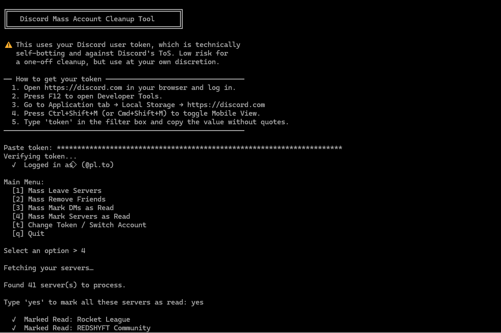

# Discord Mass Account Cleanup Tool

A Python script that lets you clean up your Discord account. Through an interactive menu, you can:
- **Mass leave servers** (by number, range, or 'all')
- **Mass remove friends** (by number, range, or 'all')
- **Mass mark DMs as read** (including Group Chats)
- **Mass mark Servers as read**



⚠️ **Disclaimer:** This tool uses your personal Discord user token. Automating user accounts ("self-botting") is against Discord's Terms of Service. Use this at your own discretion. It is generally low risk for a one-off cleanup, but you are solely responsible for your account.

## Requirements

Install the required dependencies using pip:
```bash
pip install -r requirements.txt
```

## Usage

Run the script via terminal or command prompt:
```bash
python discord_mass_cleanup.py
```

Follow the on-screen instructions. You will be prompted to paste your user token securely and then choose which cleanup operation you want to perform.

Alternatively, if you plan to run the script multiple times, you can use the provided `.env.example` file. Simply copy it, rename the copy to `.env`, and paste your token in:

```env
DISCORD_TOKEN=your_token_here
```

## How to get your Discord User Token

To get your Discord account's authorization token (which allows you to control your account via the API), you can extract it using your web browser's developer tools. 

1. Open a browser (like Chrome or Firefox) and go to the Discord Web App.
2. Log in to your account.
3. Open the Developer Tools by pressing F12 (or Ctrl + Shift + I on Windows / Cmd + Option + I on Mac).
4. Go to the Application tab at the top (if you don't see it, click the >> icon).
5. In the left sidebar, expand Local Storage and click on https://discord.com.
6. Press Ctrl + Shift + M (or Cmd + Shift + M) to toggle device emulation to "Mobile". (Discord often hides the token from local storage on desktop views, so this step makes it visible).
7. Type "token" into the filter search bar. Your token will appear on the right. (Copy the actual text, excluding the surrounding quotes).

## Testing

This project includes a comprehensive test suite mocking API responses to handle rate limits, pagination, and edge cases. To run the tests:
```bash
pytest test_discord_mass_cleanup.py
```

## License

This project is licensed under the MIT License.
