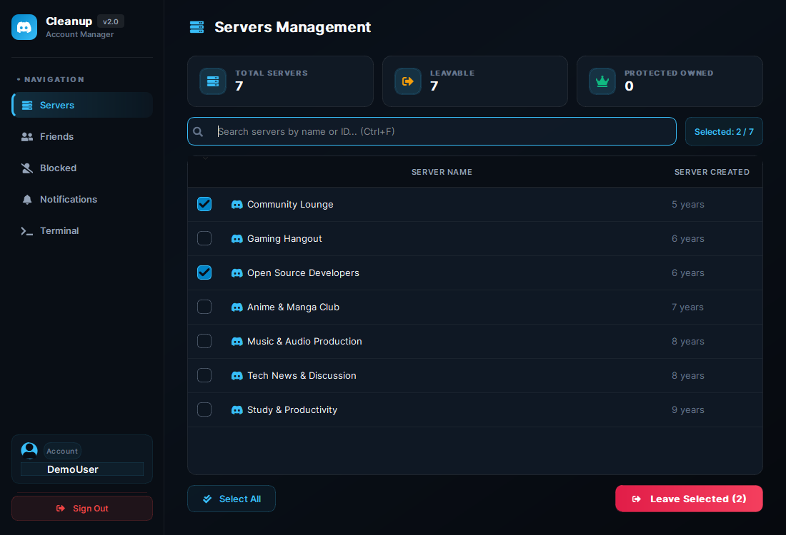
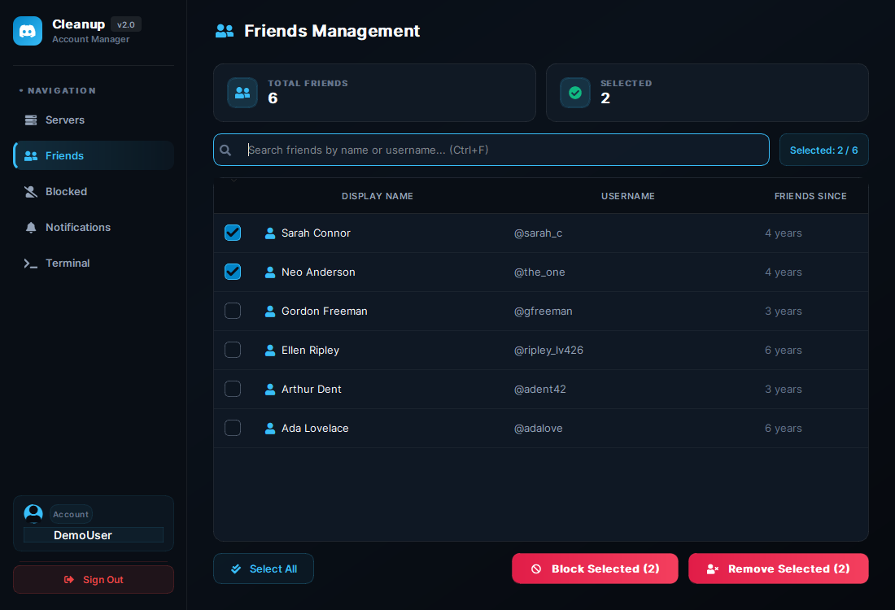
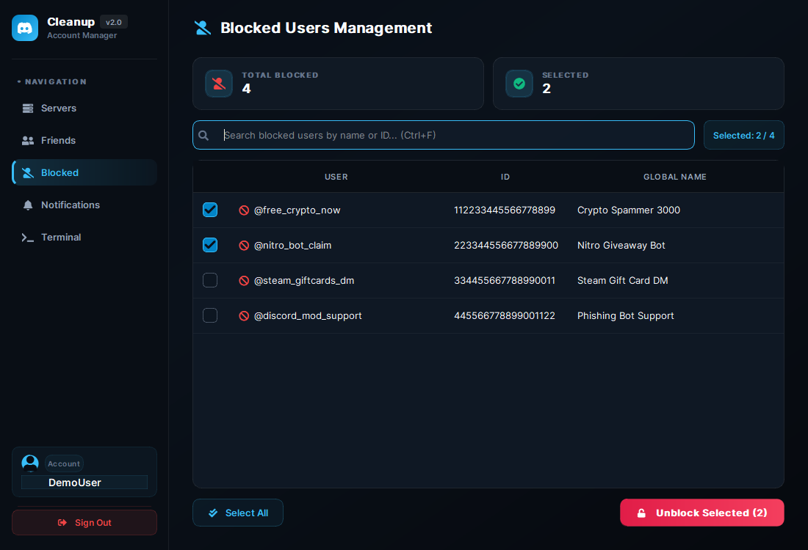
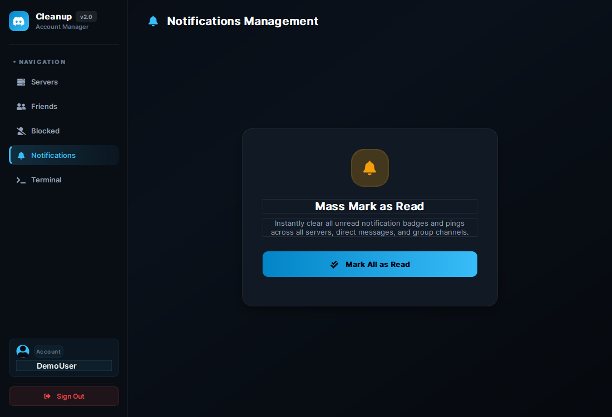

# Discord Mass Account Cleanup Tool

A robust, asynchronous desktop application and command-line utility built with Python and PyQt5 for inspecting and bulk-managing Discord servers, relationships, and notification read-states.

Designed with a strict multi-layered architecture, coordinated rate-limiting backoff, cooperative cancellation, adversarial credential redaction, and deterministic offline unit testing.



---

## Technical Highlights & Engineering Narrative

- **Asynchronous GUI Architecture**: Built with PyQt5 and decoupled background `QThread` workers communicating strictly via typed Qt signals, ensuring the main GUI event loop remains fluid at 60 FPS during long-running batch operations.
- **Shared Request Coordination & Rate Limiting**: Centralized `RequestCoordinator` enforces polite cross-worker request pacing and dynamically honors Discord `Retry-After` headers across concurrent operations without bursting upstream limits.
- **Adversarial Credential Security**: Multi-pattern token sanitization regex engine scrubs user tokens, MFA secrets, and Authorization headers across CLI prompts, stream interceptors, crash logs, and exported diagnostic files. Tokens are stored encrypted via the OS Keyring (`keyring`) and scrubbed from worker memory immediately upon task completion.
- **Fail-Safe Destructive Action Workflows**: Two-step verification workflows require explicit user selection, summary previews (displaying target counts and names), and confirmation dialogs before executing irreversible actions (such as leaving servers or deleting friendships).
- **Clean Transport Abstraction**: Fully modular HTTP transport layer built on standard protocols without browser fingerprinting, evasion tricks, or brittle global mocking hooks.
- **Comprehensive Offline Test Suite**: 100+ unit and component tests achieving ~79% statement coverage across domain models, rate limiting, network transports, worker lifecycle states, and PyQt UI pages using mocked fixtures with zero live Discord API calls.
- **Automated CI/CD Pipeline**: GitHub Actions workflow running automated lint checks (`Ruff`), static type checking (`Mypy`), cross-platform matrix testing on Ubuntu & Windows, and automated Windows executable releases with SHA256 checksums.

---

## Screenshots

| Servers Management | Friends Management | Blocked Users | Notification Badges |
|:---:|:---:|:---:|:---:|
|  |  |  |  |

---

## Architecture

```
                                  +-----------------------+
                                  |   GUI (PyQt5) / CLI   |
                                  +-----------+-----------+
                                              |
                     +------------------------+------------------------+
                     |                                                 |
         +-----------v-----------+                         +-----------v-----------+
         |  Background QThreads  |                         |  CLI Workflow Runner  |
         |  (Cancellable Worker) |                         |  (Preview & Confirm)  |
         +-----------+-----------+                         +-----------+-----------+
                     |                                                 |
                     +------------------------+------------------------+
                                              |
                                  +-----------v-----------+
                                  |   DiscordApiClient    |
                                  +-----------+-----------+
                                              |
                     +------------------------+------------------------+
                     |                                                 |
         +-----------v-----------+                         +-----------v-----------+
         |  RequestCoordinator   |                         |     HttpTransport     |
         |  (Backoff & Retries)  |                         | (Timeout & Parse JSON)|
         +-----------------------+                         +-----------+-----------+
                                                                       |
                                                           +-----------v-----------+
                                                           |   Discord REST / WS   |
                                                           +-----------------------+
```

---

## Platform Compliance & Policy Boundary

> [!IMPORTANT]
> **Platform Policy Notice**:
> This tool automates operations through standard user-account HTTP endpoints. User-token automation is not officially supported by Discord and may violate Discord's Terms of Service.
>
> - **No Circumvention**: This application does **not** employ browser fingerprint evasion, CAPTCHA bypasses, anti-bot circumvention, or hidden automation stealth.
> - **Honest Error Handling**: If Discord responds with `401 Unauthorized`, `429 Rate Limited`, or `403 Forbidden`, the application reports the status honestly and halts gracefully rather than attempting to bypass platform protections.
> - **Intended Use**: For personal account auditing, server pruning, and relationship cleanup on accounts you control.

---

## Installation & Running Locally

### Prerequisites
- Python 3.10, 3.11, 3.12, 3.13, or 3.14
- Operating System: Windows, Linux, or macOS

### 1. Clone & Setup Environment

```bash
git clone https://github.com/AnasBabari/Discord-Mass-Account-Cleanup-Tool.git
cd Discord-Mass-Account-Cleanup-Tool

# Create and activate virtual environment
python -m venv venv
# Windows:
.\venv\Scripts\activate
# Linux/macOS:
source venv/bin/activate

# Install in editable mode with development dependencies
pip install -e ".[dev]"
```

### 2. Launch Application

**Launch Desktop Graphical Interface:**
```bash
python -m discord_cleanup
# or
discord-cleanup-gui
```

**Launch Interactive CLI Mode:**
```bash
python -m discord_cleanup --cli
# or
discord-cleanup
```

---

## Development & Quality Assurance

### Run Unit Test Suite
```bash
python -m pytest tests/ -v --cov=src/discord_cleanup --cov-report=term-missing
```

### Run Static Analysis & Linting
```bash
python -m flake8 src tests --max-line-length=140
python -m mypy
```

### Build Windows Standalone Executable
```bash
pyinstaller discord_cleanup.spec
```
The compiled binary will be placed under `dist/Discord-Mass-Cleanup-Tool.exe`.

---

## Project Structure

```
├── pyproject.toml                     # Modern package metadata & tool configuration
├── discord_cleanup.spec               # PyInstaller standalone executable recipe
├── README.md                          # Project documentation & engineering overview
├── LICENSE                            # MIT License
├── .github/
│   └── workflows/
│       └── release.yml                # CI matrix testing & release deployment
├── src/
│   └── discord_cleanup/
│       ├── __init__.py                # Package root
│       ├── __main__.py                # CLI / GUI entrypoint dispatcher
│       ├── models/
│       │   └── domain.py              # Typed domain dataclasses (Guild, Relationship, User)
│       ├── security/
│       │   ├── token_sanitizer.py     # Adversarial regex token redactor
│       │   └── credentials.py         # OS Keyring secure token storage
│       ├── transport/
│       │   └── http_transport.py      # Clean HTTP transport abstraction
│       ├── api/
│       │   ├── exceptions.py          # Domain error hierarchy
│       │   ├── rate_limiter.py        # Cross-thread request coordinator & backoff
│       │   └── client.py              # Discord REST API client
│       ├── gateway/
│       │   └── notifications.py       # Gateway WebSocket notification reader
│       ├── logging/
│       │   └── logger.py              # Redacting logger and Qt signal handlers
│       ├── cli/
│       │   └── main.py                # Interactive CLI with preview & confirmation
│       ├── workers/                   # Background QThread workers
│       │   ├── base.py                # CancellableTokenWorker base
│       │   ├── login.py               # Token verification & avatar loader
│       │   ├── fetch.py               # Guild/friend/blocked fetchers
│       │   ├── batch.py               # Batch removal/leave/block workers
│       │   └── notifications.py       # Notification ack worker
│       └── ui/
│           ├── theme.py & theme.qss   # Design system tokens & stylesheet
│           ├── components.py          # Custom Qt components (GlassCard, StatCard, Toast)
│           ├── app.py                 # MainWindow & Qt application lifecycle
│           └── pages/                 # UI pages (Login, Servers, Friends, Blocked, Logs)
└── tests/                             # Offline mocked unit test suite
    ├── conftest.py                    # Pytest fixtures & offscreen Qt setup
    ├── test_token_security.py         # Adversarial token redactor tests
    ├── test_transport.py              # Transport & timeout tests
    ├── test_rate_limiter.py           # Rate limiting & cancellation tests
    ├── test_api_client.py             # REST API client tests
    ├── test_gateway.py                # WebSocket Gateway tests
    ├── test_domain_models.py          # Data model serialization tests
    ├── test_cli.py                    # CLI workflow & selection parser tests
    ├── test_workers.py                # Worker signal & cancellation tests
    ├── test_gui_lifecycle.py          # MainWindow lifecycle & worker leak tests
    ├── test_gui_components.py         # Qt component tests
    └── test_gui_pages.py              # Page interaction tests
```

---

## License

This project is licensed under the terms of the [MIT License](LICENSE).
