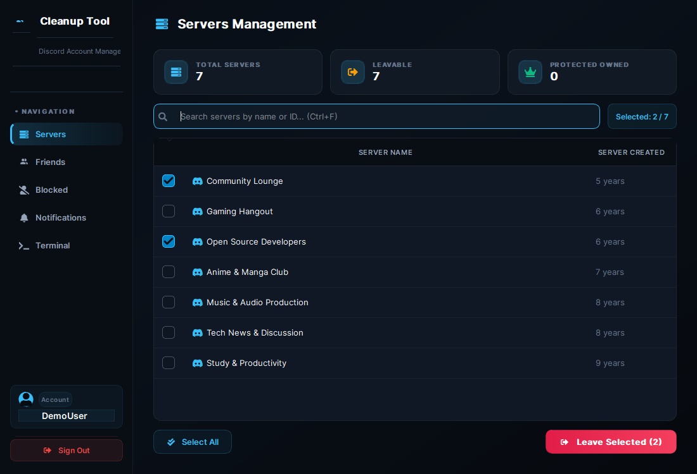
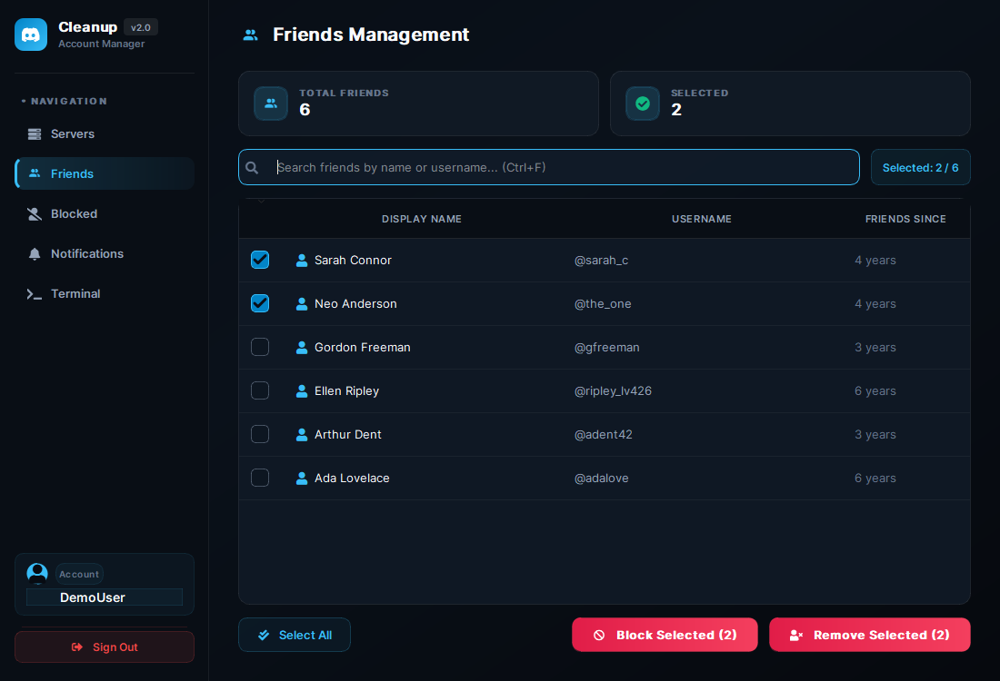
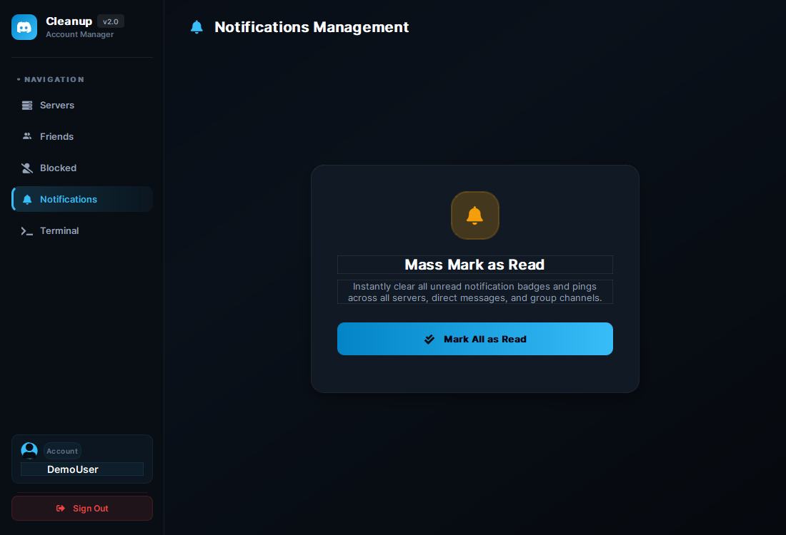

# Discord Mass Account Cleanup Tool

A Windows desktop application and command-line utility for carrying out account-clean-up actions through Discord's HTTP API and Gateway. It supports explicit selection of servers, relationships, and notifications while keeping the long-running work off the GUI thread.



## Download

> **No Python required** — download the latest Windows executable from the [Releases page](https://github.com/AnasBabari/Discord-Mass-Account-Cleanup-Tool/releases/latest).

The executable is built by the tagged-release workflow. The source tree remains available for inspection and local development.

## What it does

- Lists servers and relationships, with search and explicit selection.
- Leaves selected servers, removes selected friends, or blocks selected users.
- Reads notifications through the Discord Gateway and reports progress.
- Provides a PyQt5 GUI with background `QThread` workers, cancellation, progress, and error signals.
- Provides an interactive CLI for environments where a GUI is not appropriate.
- Stores a token through the operating system credential manager when `keyring` is available.
- Handles HTTP timeouts and Discord `429` responses with bounded retries and `Retry-After` support. HTML responses are treated as a possible upstream protection page rather than being printed verbatim.

The tool uses the REST API for account operations and the Gateway only for notification read-state work. It does not claim to provide an official Discord bulk-management API.

## Responsible use and account safety

This is an account-automation tool. Discord user-token automation and self-bot behaviour may violate Discord's Terms of Service and can result in account action. Use only on an account you control, at a rate that is appropriate for the service, and after reviewing the current Discord policies. Never paste a token into an issue, chat, log, or screen recording. The project does not attempt to evade enforcement or guarantee that an account will not be rate-limited.

## Screenshots

| Servers | Friends | Notifications |
|---|---|---|
|  |  |  |

## Architecture

```
GUI / CLI
    |
    +-- REST helpers: guilds, relationships, leave/remove/block
    |       +-- timeout handling
    |       +-- Retry-After-aware 429 handling
    |       +-- bounded retry count
    |
    +-- Gateway helper: notification read-state
    |
    +-- QThread workers (GUI only)
            +-- progress, result, error, and finished signals
```

The request helper owns response parsing and retry decisions. GUI workers call the helper from `QThread`s so network activity does not block the event loop. Tests use mocked HTTP and Gateway responses; the test suite does not contact Discord or validate live-account behaviour.

## Run from source

### Requirements

- Python 3.10 or newer
- A Windows Qt runtime for the GUI (provided by `PyQt5`)

```bash
cd source
python -m pip install -r requirements.txt
```

### GUI

```bash
cd source
python gui_app.py
```

### CLI

```bash
cd source
python discord_mass_cleanup.py
```

### Build the Windows executable

```bash
cd source
python -m pip install pyinstaller
pyinstaller gui_app.spec
```

The executable is written to `source/dist/gui_app.exe` before the release workflow gives it its distribution name.

## Testing

From the repository root:

```bash
cd source
python -m pytest -q
```

The current suite contains **72 tests**. It covers request pagination and selection, HTTP status/error handling, timeout and `Retry-After` behaviour, Gateway payload handling, CLI flows, GUI components/pages, and worker signal/cancellation paths. GUI tests run headlessly in CI with `QT_QPA_PLATFORM=offscreen`.

The tests are deterministic and mocked. A green run demonstrates the local request and UI contracts; it is not evidence that a live token is valid or that Discord will permit a particular account action.

## Project structure

```
├── README.md
├── LICENSE
├── .github/workflows/release.yml   # test, build, and publish tagged releases
└── source/
    ├── gui_app.py                  # PyQt5 desktop entry point
    ├── discord_mass_cleanup.py     # REST helpers and CLI entry point
    ├── workers.py                  # background QThread workers
    ├── gui_app.spec                # PyInstaller build configuration
    ├── requirements.txt
    ├── test_discord_mass_cleanup.py # API and CLI tests
    ├── test_gui.py                 # GUI component tests
    ├── test_gui_pages.py           # page-level GUI tests
    ├── test_workers.py             # worker signal/error tests
    ├── ui/                         # theme, components, and pages
    └── assets/                     # screenshots used by the README and UI
```

## Release workflow

Pushing a tag matching `v*` runs the complete test suite on Ubuntu before a Windows build creates the executable release asset. The workflow sets Qt to offscreen mode for tests and uses pinned GitHub Action revisions. A failed test job prevents the release build.

## License

This project is licensed under the [MIT License](LICENSE).
